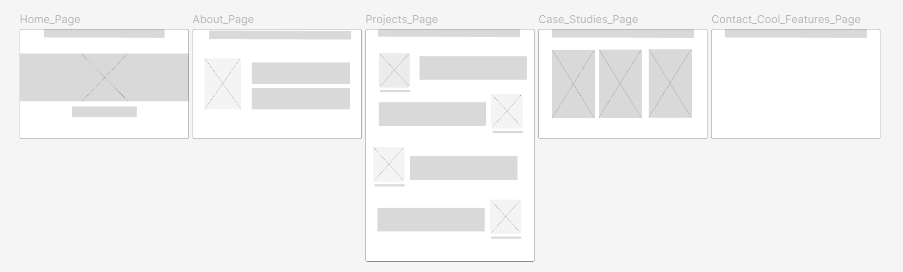

# Stephanie_Portfolio

# My Simple Portfolio Site : DevStephanie 

Overview
This project is a straightforward portfolio website built using only HTML and CSS. It showcases my personal projects, coursework, and passion projects in various areas including product development and mobile development.

Features a clean and minimalist design
Responsive layout for various screen sizes
Sections for:
Personal projects
Coursework
Passion projects
Case Studies 

Focus areas:
Product development
Mobile development
Machine Learning & AI

Technologies Used
HTML5
CSS3

Rough wireframe: 

## Rough Wireframe Draft: 

